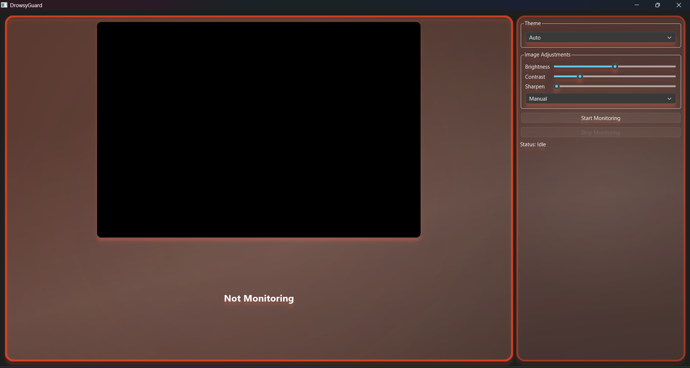
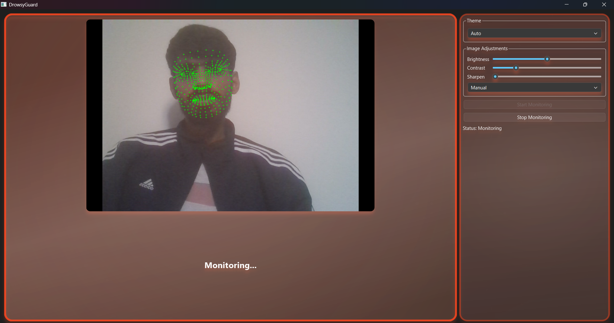
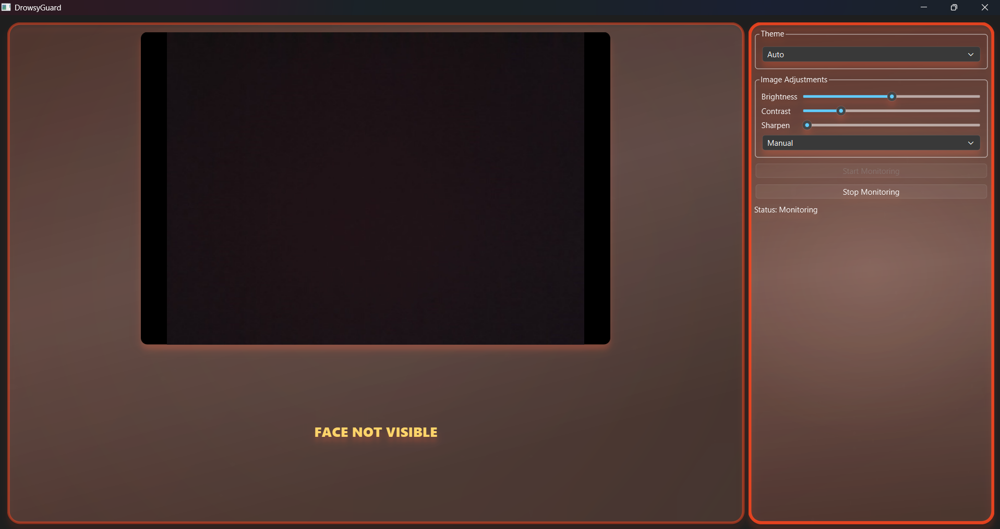
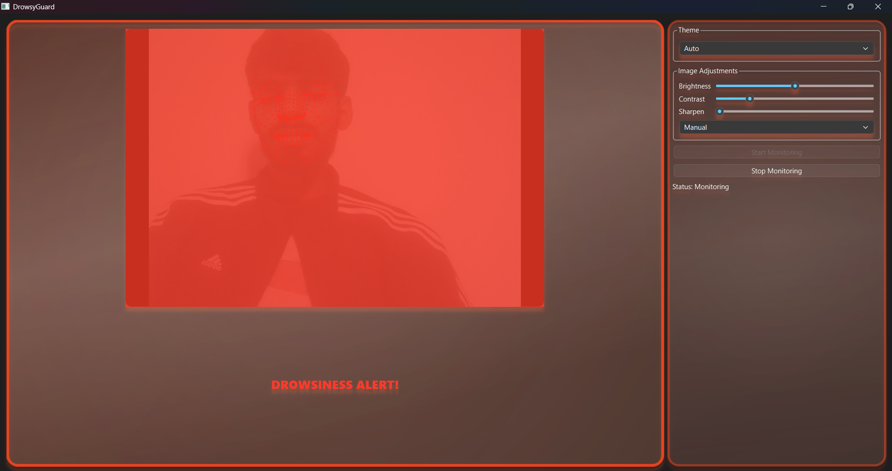

---

# 🔥 DrowsyGuard – Real-Time Driver Drowsiness Detection

### *AI-powered • Glass UI • Real-Time Face Tracking*

<p align="center">
  
  
  
  
  
</p>

---

## 🚗 Overview

**DrowsyGuard** is a real-time AI system designed to detect driver drowsiness using **facial landmarks**, **EAR (Eye Aspect Ratio)**, and **MediaPipe FaceMesh**.
The project features a **premium glass-morphic UI** with:

✨ neon shockwave alert
✨ animated flash overlay
✨ fire-pulse glow effects
✨ smooth UI transitions
✨ loud audio warnings

Perfect for:

* Resume & portfolio showcase
* AI + Computer Vision demonstration
* Qt/PySide6 GUI projects
* Real-world safety applications

---

## ✨ Features

### 🔍 Real-Time Detection

* 468-point MediaPipe FaceMesh
* EAR-based drowsiness detection
* Face-not-visible detection

### 🎨 Premium Animated UI (PySide6 + QPainter)

* Glass-morphism cards
* Fire glow + pulse effects
* Red flash alert overlay
* Neon expanding shockwave animation
* Smooth hover transitions

### 🔊 Alert System

* Beeping sound alerts
* Flash screen warning
* Shockwave ripple
* “DROWSINESS ALERT!” visual highlight

### 🧱 Modular Codebase

* `camera_processor.py` → live frame processing
* `ear_detector.py` → EAR algorithm
* `glass_card.py` → animated glass UI
* `flash_overlay.py` → flashing alert
* `shockwave.py` → neon shockwave
* `main_window.py` → full GUI controller

---

## 📂 Project Structure

```
DrowsyGuard/
│── main.py
│── requirements.txt
│
├── core/
│   ├── camera_processor.py
│   ├── ear_detector.py
│
├── gui/
│   ├── main_window.py
│   ├── glass_card.py
│   ├── flash_overlay.py
│   ├── shockwave.py
│   ├── style.qss
│
└── assets/
    ├── Screenshot1.png
    ├── Screenshot2.png
    ├── Screenshot3.png
    ├── Screenshot4.png
    ├── alert.wav
    ├── noface.wav
```

---

## 🚀 Installation

### 1️⃣ Clone the repository

```bash
git clone https://github.com/vaibhavx002/driver-drowsiness-detection
cd driver-drowsiness-detection
```

### 2️⃣ Create virtual environment

```bash
python -m venv venv
venv\Scripts\activate   # Windows
```

### 3️⃣ Install dependencies

```bash
pip install -r requirements.txt
```

### 4️⃣ Run the application

```bash
python main.py
```

---

## ⚙️ How Detection Works

### 🎯 EAR (Eye Aspect Ratio)

* Detect eye landmarks
* Compute EAR value
* EAR < threshold → eyes closing
* Consistently low EAR → **drowsy event**

### 🤖 MediaPipe FaceMesh

* Extracts 468 facial landmarks
* High accuracy
* Works even in low-light scenarios

### 🔔 Alert Flow

1. EAR threshold exceeded
2. Flash overlay begins
3. Neon shockwave animates
4. Sound alert triggered
5. UI displays **DROWSINESS ALERT!**

---

## 🛠 Tech Stack

| Component            | Technology                       |
| -------------------- | -------------------------------- |
| **UI**               | PySide6 (Qt6), QSS, QPainter     |
| **Face Tracking**    | MediaPipe FaceMesh               |
| **Computer Vision**  | OpenCV                           |
| **Drowsiness Logic** | EAR algorithm                    |
| **Audio Alerts**     | QSoundEffect                     |
| **Design System**    | Glassmorphism + animated effects |

---

## 📸 Screenshots

<p align="center">
  <br><br>
  <br><br>
  <br><br>
  
</p>

---

## ⭐ Why This Project Stands Out

* Real-world computer vision implementation
* Custom-built animated Qt UI
* Clean, modular, extensible code
* Recruiter-friendly project
* Great for GitHub profile & LinkedIn

---

## 🛡 License

MIT License © 2025

---

## 💬 Connect

If you like this project, please ⭐ star the repo!

**LinkedIn:**
[https://www.linkedin.com/in/vaibhavx002/](https://www.linkedin.com/in/vaibhavx002/)

---


